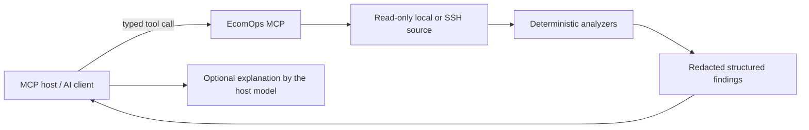

# AI host model

EcomOps is model-agnostic. Its MCP server reads configured logs, applies
bounded read-only access, runs deterministic analyzers, redacts sensitive
values, and returns structured findings.

The EcomOps process does not call an LLM provider. It therefore does not need
an OpenAI, Anthropic, or local-model API key for normal MCP use. The host may
use its own model session to explain findings after receiving the MCP result.

This separation is intentional:

- log access and security policy stay in EcomOps;
- model choice, prompting, and explanation stay in the MCP host;
- no full raw log is sent to a model by EcomOps;
- no external AI network call is made by the EcomOps MCP server;
- deterministic findings remain available when no model is connected.

The optional `noop` provider in the Python package is a compatibility seam for
future integrations. It performs no network request and must not be described
as an active AI service.
