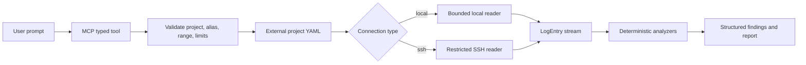
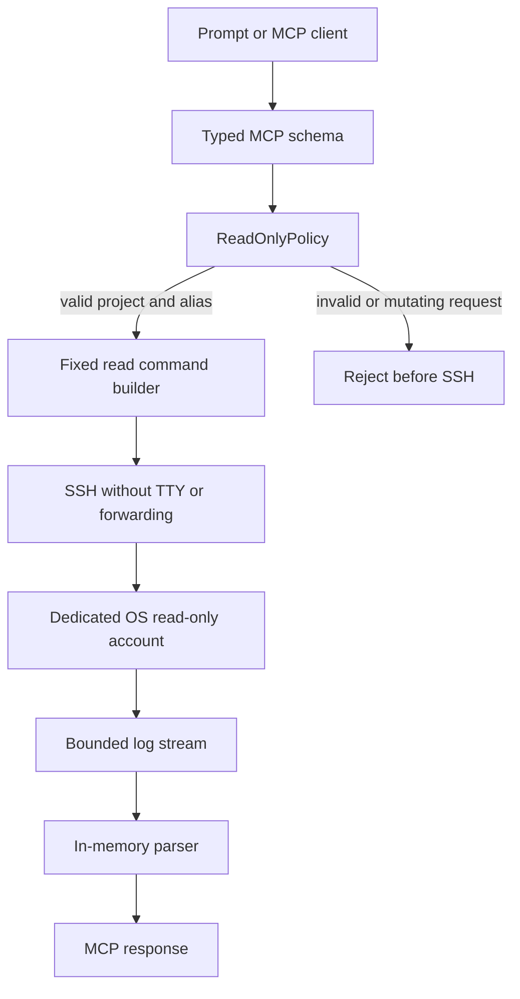
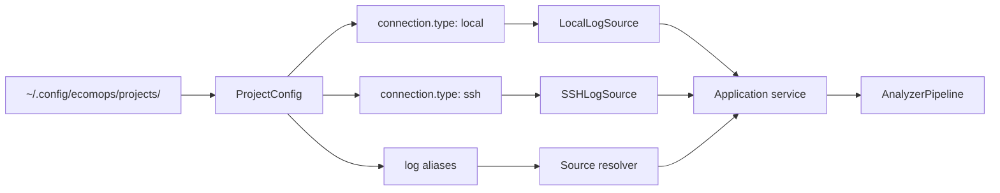
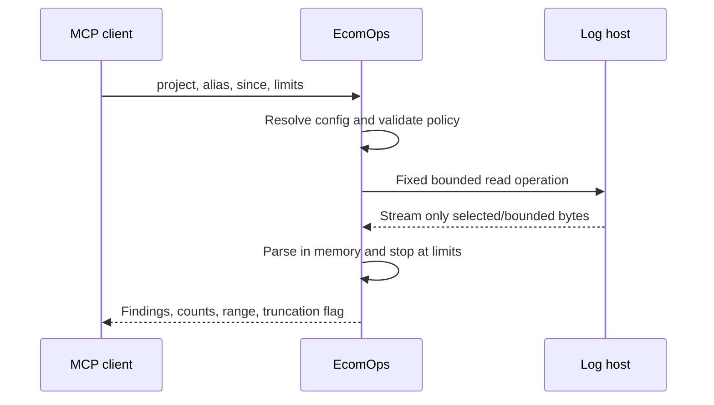

# EcomOps Architecture

This document describes the public, read-only architecture. All names,
domains, paths, and credentials in examples are synthetic.

## Prompt-to-analysis flow

The prompt is translated into typed arguments. It never becomes a shell
command. The analyzer pipeline is independent of whether the source is local
or remote.

## Read-only security boundary

There is no generic `execute_ssh(command)` tool. The server does not accept a
raw command, raw remote path, script, upload, SFTP write, shell redirection,
`sudo`, or remediation operation. Output is bounded by bytes, lines, timeout,
and time range. No temporary files or fetched-log cache are required.

Application-level restrictions are defense in depth, not a replacement for
permissions. The SSH account should have read-only operating-system access,
host-key verification should be enabled, and the standard package should be
installed from a trusted source. Modified code, compromised dependencies, or a
write-capable SSH account are outside the package guarantee.

## Project and source model

Each alias maps to one configured path and log type. A local project needs no
SSH credentials. An SSH password is never stored; the CLI or supported MCP
elicitation flow requests missing secrets without persisting them.

## Large-log retrieval

For recent ranges, the reader takes a single bounded read from the end of a
chronological text log and filters it to the requested window; the byte and
line limits are hard bounds, not a target to expand toward. Exact arbitrary
historical ranges may require a remote scan when no index exists; either way,
the result reports incomplete sampling whenever the bounded read could not
cover the full requested window.
