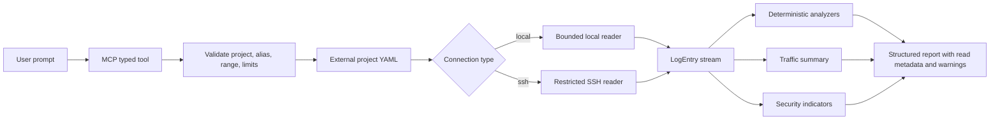
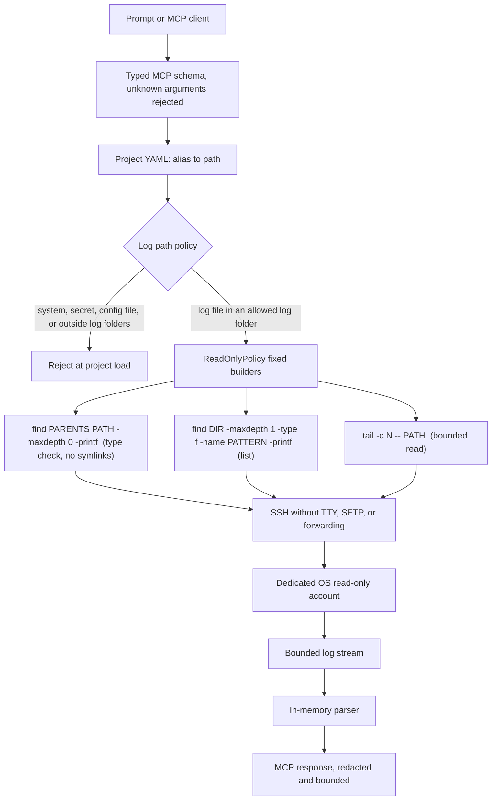
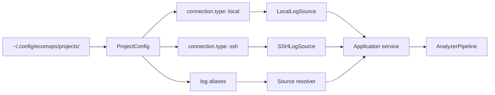
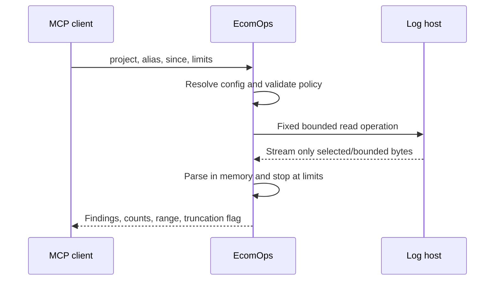
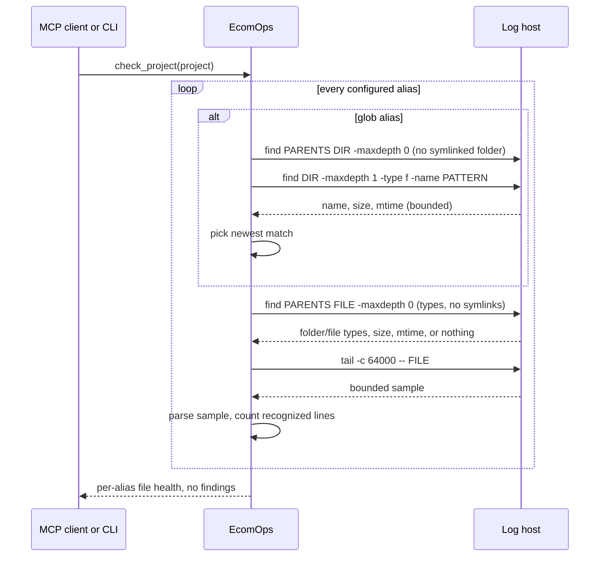
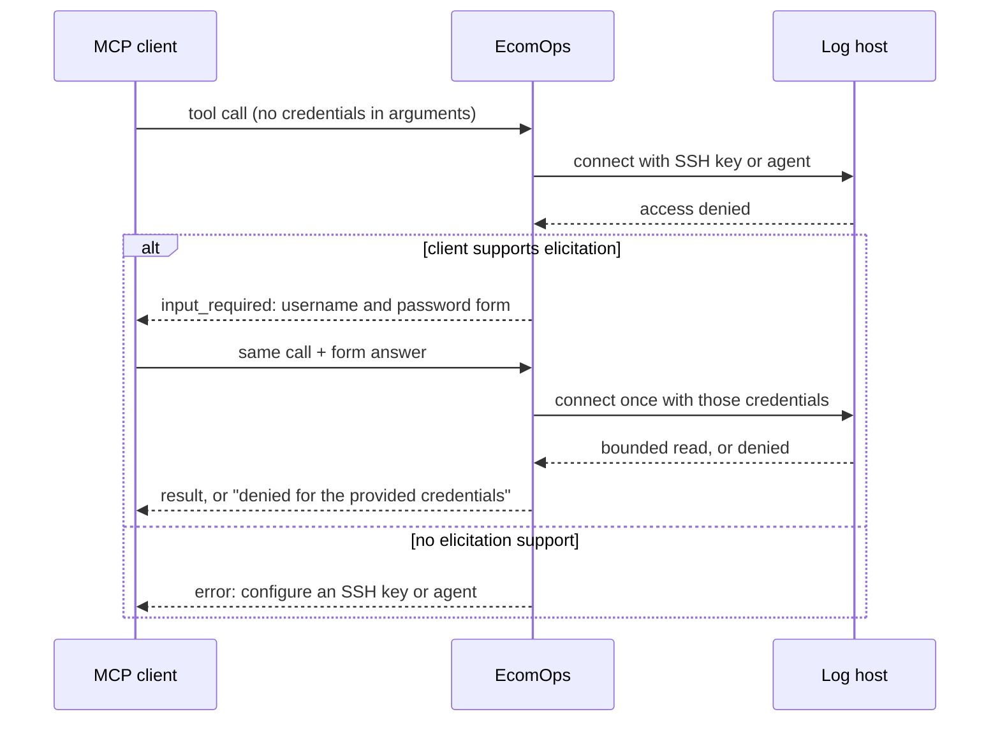

# EcomOps Architecture

This document describes the public, read-only architecture. All names,
domains, paths, and credentials in examples are synthetic.

## Prompt-to-analysis flow

```mermaid
flowchart LR
    P[User prompt] --> M[MCP typed tool]
    M --> V[Validate project, alias, range, limits]
    V --> C[External project YAML]
    C --> R{Connection type}
    R -->|local| L[Bounded local reader]
    R -->|ssh| S[Restricted SSH reader]
    L --> E[LogEntry stream]
    S --> E
    E --> A[Deterministic analyzers]
    E --> TS[Traffic summary]
    E --> SS[Security indicators]
    A --> O[Structured report with read metadata and warnings]
    TS --> O
    SS --> O
```

The prompt is translated into typed arguments. It never becomes a shell
command. The analyzer pipeline is independent of whether the source is local
or remote.

## Read-only security boundary

```mermaid
flowchart TD
    U[Prompt or MCP client] --> T[Typed MCP schema, unknown arguments rejected]
    T --> C[Project YAML: alias to path]
    C --> LP{Log path policy}
    LP -->|system, secret, config file, or outside log folders| X[Reject at project load]
    LP -->|log file in an allowed log folder| B[ReadOnlyPolicy fixed builders]
    B --> K1["find PARENTS PATH -maxdepth 0 -printf  (type check, no symlinks)"]
    B --> K2["find DIR -maxdepth 1 -type f -name PATTERN -printf  (list)"]
    B --> K3["tail -c N -- PATH  (bounded read)"]
    K1 --> H[SSH without TTY, SFTP, or forwarding]
    K2 --> H
    K3 --> H
    H --> Q[Dedicated OS read-only account]
    Q --> F[Bounded log stream]
    F --> R[In-memory parser]
    R --> Y[MCP response, redacted and bounded]
```

There is no generic `execute_ssh(command)` tool. Over SSH the server runs only
the three fixed forms above, always on a configured path that passed the log
path policy. It does not accept a raw command, raw remote path, script,
upload, SFTP write, shell redirection, `sudo`, or remediation operation, and it
never bootstraps access (`ssh-copy-id`, `authorized_keys` edits, remote setup).
Output is bounded by bytes, lines, timeout, and time range. No temporary files
or fetched-log cache are required.

The log path policy is checked when a project is loaded: a path must be inside
an allowed log folder (`log_dirs`, or the connection root and `/var/log`) and
have a log-like name, and system folders, secret folders, Magento `app/etc`,
and configuration or secret files are always refused. Locally, the real path
is checked again after resolving symlinks. Over SSH, the file check refuses a
symlinked file or parent folder (up to the allowed log folder), directories,
and special files before every read and listing.

Application-level restrictions are defense in depth, not a replacement for
permissions. The SSH account should have read-only operating-system access,
host-key verification should be enabled, and the standard package should be
installed from a trusted source. Modified code, compromised dependencies, or a
write-capable SSH account are outside the package guarantee.

## Project and source model

```mermaid
flowchart LR
    D[~/.config/ecomops/projects/] --> PC[ProjectConfig]
    PC --> LC[connection.type: local]
    PC --> SC[connection.type: ssh]
    PC --> AL[log aliases]
    LC --> LR[LocalLogSource]
    SC --> SR[SSHLogSource]
    AL --> RS[Source resolver]
    LR --> AP[Application service]
    SR --> AP
    RS --> AP
    AP --> AN[AnalyzerPipeline]
```

Each alias maps to one configured path (or a file-name glob such as
`transfer-*.log`, which selects the newest match) and a log type. A local project needs no
SSH credentials. An SSH password is never stored; the CLI or supported MCP
elicitation flow requests missing secrets without persisting them.

## Large-log retrieval

```mermaid
sequenceDiagram
    participant C as MCP client
    participant E as EcomOps
    participant H as Log host
    C->>E: project, alias, since, limits
    E->>E: Resolve config and validate policy
    E->>H: Fixed bounded read operation
    H-->>E: Stream only selected/bounded bytes
    E->>E: Parse in memory and stop at limits
    E-->>C: Findings, counts, range, truncation flag
```

For recent ranges, the reader takes a single bounded read from the end of a
chronological text log and filters it to the requested window; the byte and
line limits are hard bounds, not a target to expand toward. Exact arbitrary
historical ranges may require a remote scan when no index exists; either way,
the result reports incomplete sampling whenever the bounded read could not
cover the full requested window.

## Source inspection and discovery

```mermaid
sequenceDiagram
    participant C as MCP client or CLI
    participant E as EcomOps
    participant H as Log host
    C->>E: check_project(project)
    loop every configured alias
        alt glob alias
            E->>H: find PARENTS DIR -maxdepth 0 (no symlinked folder)
            E->>H: find DIR -maxdepth 1 -type f -name PATTERN
            H-->>E: name, size, mtime (bounded)
            E->>E: pick newest match
        end
        E->>H: find PARENTS FILE -maxdepth 0 (types, no symlinks)
        H-->>E: folder/file types, size, mtime, or nothing
        E->>H: tail -c 64000 -- FILE
        H-->>E: bounded sample
        E->>E: parse sample, count recognized lines
    end
    E-->>C: per-alias file health, no findings
```

`list_log_files` runs only the listing step. `check_project` never runs the
analyzers. A transport error is reported per alias; an authentication denial
stops the whole check.

## MCP password elicitation

```mermaid
sequenceDiagram
    participant C as MCP client
    participant E as EcomOps
    participant H as Log host
    C->>E: tool call (no credentials in arguments)
    E->>H: connect with SSH key or agent
    H-->>E: access denied
    alt client supports elicitation
        E-->>C: input_required: username and password form
        C->>E: same call + form answer
        E->>H: connect once with those credentials
        H-->>E: bounded read, or denied
        E-->>C: result, or "denied for the provided credentials"
    else no elicitation support
        E-->>C: error: configure an SSH key or agent
    end
```

The credentials exist only in memory for that one call. They are not tool
arguments and are never logged, echoed, cached, or written to YAML. A declined
form or a second denial ends the call; EcomOps does not ask again.
